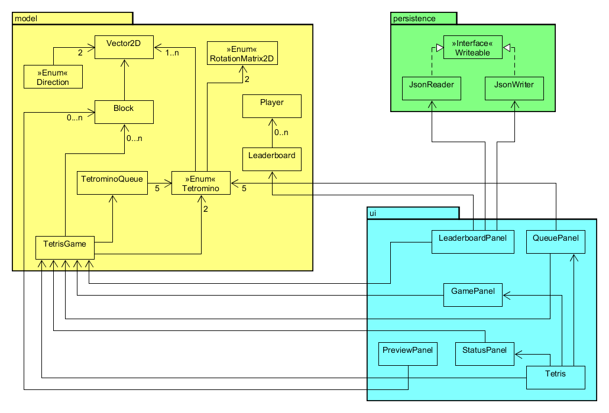

# CPSC210 Personal Project - Tetris

## Proposal
### What will the application do?
The application will be a playable version of Tetris.
The game will have a feature allowing players to track their highscores.
It will incorporate some standard features of Tetris, such as being able to see
the next five upcoming Tetrominos, as well as being able to move the Tetrominos
left and right, as well as rotate them. Initially the plan is to only include an
endless mode with other gamemodes being an option once the core of the game is
implemented.

### Who will use it?
Really anyone that likes to play Tetris and is looking for an offline
version of the game. The most popular version right now is found on an 
online website called Jstris, and I have yet to find a good offline
version of the game for myself.

### Why is this project of interest to you?
I enjoy playing Tetris and would like to be able to play the game offline,
since there are no good offline versions.

## User Stories
### Phase 1:
1. As a user I want to be able to see the highscores.
2. As a user I want to be able to add my own score to the list of highscores.
3. As a user I want to be able to see the next Tetrominos in queue.
4. As a user I want to be able to pull the next Tetramino from the queue.

## Phase 2:
1. As a user I want to have my scores saved when quitting the application.
2. As a user I want to load my saved scores when I start the application.

## Phase 3:
1. As a user I want to be able to add my score onto a leaderboard after playing a game.
2. As a user I want to add a Tetromino onto a board and move and rotate it.
3. As a user I want to stack multiple Tetrominos on top of each other.
4. As a user I want to see the Tetrominos on the board.
5. As a user I want to be able to load my leaderboard from a file.
6. As a user I want to be able to save my leaderboard.
7. As a user I want to be able to see my score.
8. As a user I want to be able to see if my leaderboard has been loaded or saved.
9. As a user I want to see the next five tetrominos.

## Phase 4:

#### Task 2:
I used a HashMap to make it easier to keep track of and remove lines that contain more 10 blocks or more.
In the code the HashMap is called associated with the field `lineMap`. The keys are the line numbers (y-coordinates) of 
the board and the associated values are ArrayLists containing the blocks which have the same y-coordinate as 
the corresponding key. The methods that use this map are all found in the TetrisGame class, specifically:
- `TetrisGame()`, the map is constructed here.
- `initializeLineMap()`, used to setup the map.
- `placeTetrominoOnBoard()`, updates the map when a Tetromino is placed on the board.
- `clearLines()`, the lines that can be cleared are deleted from the map.
- `linesToBeCleared()`, (helper method in `clearLines()`) a loop over all entries in the map is used to find what 
lines are full, i.e. what lines contain 10 blocks or more.
- `boardFromLineMap()`, translates the map into a board.
- `lineMapFromBoard()`, translates a board into a map.

#### Task 3: Ideas for refactoring

* Refactor the UI package. A lot of the classes largely share the same code, as an example, `GamePanel` 
and `PreviewPanel` both are responsible for rendering blocks and as such they both use the same methods.
I would want to create an abstract class that extends `JPanel`, containing the common methods and then have `GamePanel`
and `PreviewPanel` extend said abstract class.
* The `LeaderboardPanel` class, has a lot of methods contained in it, some of which would be better of in a separate
class for better readability.

#### Additional user stories
1. As a user I want to clear lines and have my score incremented by the number of lines I clear.
2. As a user I want to see renders of the next five tetrominos.
3. As a user I want to save my current Tetromino for later and jump right to the next one in the queue.
4. As a user I want to see a render of my saved Tetromino.

## Appendix

### Terminology
I might be using some terminology that might be new or unclear to people that
have never played the game, so I will define any such terms under this heading.
- **Line**: A horizontal slice of a tetris board, usually contains at 
least one square.
- **Clearing a line**: Filling in a line, making it disappear.
- **Tetrominos**: The basic shapes of Tetris. They are made of different 
arrangements of squares. See the image below for examples.
(Note: Left handed versions of the L and the offset square shape exist 
as well)

